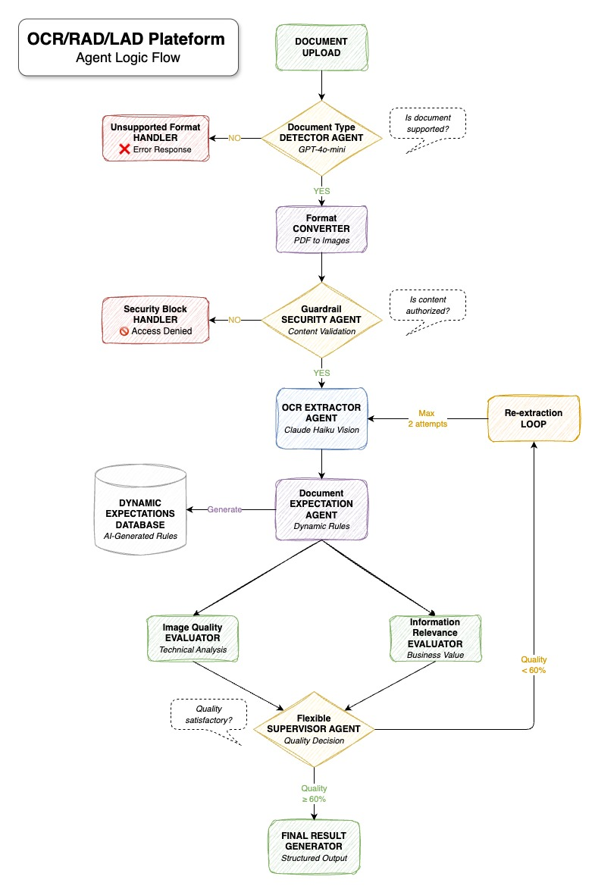

# OCR/LAD/RAD Intelligence Platform

### Advanced Multi-Agent Document Analysis System

*Transform complex document processing into intelligent, structured data extraction*

[](https://huggingface.co/spaces/JTh34/ocr-lad-rad-platform)
[](https://python.org)
[](https://reactjs.org)
[](https://fastapi.tiangolo.com)

---

## 🎯 The Problem We Solve

Document processing in 2025 still faces critical challenges:

🔹 **Manual Data Entry Hell** - Hours spent copying information from PDFs, invoices, and forms  
🔹 **Inconsistent Quality** - Traditional OCR fails with poor scans, complex layouts, or multi-page documents  
🔹 **Business Logic Gaps** - Raw text extraction without understanding context or document structure  
🔹 **Scale Bottlenecks** - Processing hundreds of documents manually is time-consuming and error-prone

## 🚀 Our Solution

OCR/LAD/RAD Platform combines **multi-agent AI intelligence** with **adaptive quality supervision** to deliver professional-grade document analysis. Our system doesn't just read text—it understands documents, validates quality, and ensures business-ready results.

**Key Innovation**: Dynamic expectations and flexible supervision that adapts to different document types, ensuring 60%+ quality acceptance while maintaining efficiency.

---

## 🏗️ Architecture - Intelligent Multi-Agent Workflow



Our platform employs a **sophisticated 8-stage multi-agent workflow** that mimics how document processing experts approach complex analysis:

### 🔍 **Stage 1: Smart Document Detection**
AI-powered document type identification and format validation:
- **Multi-format Support**: PDF, JPG, PNG, GIF, WebP, BMP, TIFF
- **Intelligence**: GPT-4o-mini determines document suitability and processing strategy
- **Multi-page Handling**: Automatic PDF-to-image conversion with page management

### 🛡️ **Stage 2: Security & Ethics Validation**
Content guardrails ensure safe and appropriate processing:

- **Risk Assessment**: Low/medium/high risk classification
- **Content Filtering**: Blocks inappropriate or harmful content
- **Authorization Logic**: Automated security clearance decisions

### 👁️ **Stage 3: Advanced OCR Extraction**
Claude Vision-powered text and structure extraction:

- **Visual Intelligence**: Understands layouts, tables, and document sections
- **Structured Output**: JSON-formatted data with entities, dates, amounts
- **Multi-page Synthesis**: Combines information across document pages

### 🚨 **Stage 4: Dynamic Expectation Generation**
Revolutionary AI-generated quality expectations:

- **Document-Specific Rules**: Custom expectations based on document type
- **Critical Field Detection**: Identifies must-have vs nice-to-have information
- **Business Context**: Understands practical use cases and requirements

### ⚖️ **Stage 5: Parallel Quality Assessment**
Dual evaluation system for comprehensive quality control:

- **Image Quality Evaluator**: Technical assessment (resolution, clarity, OCR-readiness)
- **Information Relevance Evaluator**: Business value assessment using dynamic expectations
- **Real-time Scoring**: Live quality metrics with confidence levels

### ⚙️ **Stage 6: Flexible Supervisor Decision**
Intelligent quality supervision with efficiency focus:

- **Adaptive Thresholds**: 60% early acceptance, 40% minimum acceptable
- **Business Logic**: Practical decisions balancing quality vs processing time
- **Re-extraction Control**: Maximum 2 attempts for optimal efficiency

### ♾️ **Stage 7: Smart Re-processing Loop**
Automated quality improvement when needed:

- **Conditional Re-extraction**: Only when quality improvements are likely
- **Attempt Limiting**: Prevents infinite loops and ensures timely delivery
- **Progressive Enhancement**: Each iteration builds on previous results

### 📝 **Stage 8: Structured Results Generation**
Professional output formatting for immediate business use:

- **Multi-format Export**: JSON, structured text, formatted reports
- **Quality Metrics**: Transparency in confidence levels and processing details
- **Business Intelligence**: Actionable insights and extracted key information

---

## ✨ Core Features

### 🦾 **Current Capabilities**
- **Multi-Agent Processing**: 8 specialized AI agents working in concert
- **Real-time Interface**: Modern React UI with live progress updates
- **Quality Guarantee**: Adaptive supervision ensuring business-ready results
- **Multi-format Support**: Handle documents, images, and multi-page PDFs
- **Professional Output**: Structured data extraction with confidence scoring

### 📋 **Use Cases**
- **Invoice Processing**: Extract amounts, dates, vendor information, line items  
- **Form Digitization**: Convert paper forms to structured digital data  
- **Contract Analysis**: Identify key terms, dates, parties, and obligations  
- **Receipt Management**: Capture expenses, merchants, categories, and amounts  
- **Identity Documents**: Extract names, dates, numbers, and addresses  
- **Technical Documents**: Process manuals, specifications, and technical drawings

### 👩🏻‍💻 **User Experience**
- **Drag & Drop Upload**: Intuitive document submission
- **Live Processing Updates**: Real-time progress via WebSocket connection
- **Quality Visualization**: Interactive metrics dashboard
- **Professional Terminal**: System logs with technical insights
- **One-Click Export**: Copy structured results instantly

---

## 🔬 Technical Innovation

### **Multi-Agent Architecture**
Built on **LangGraph** and **LangChain Expression Language (LCEL)** for enterprise-grade agent orchestration:

```python
# Example agent chain structure
self.document_detector_chain = (
    self.document_detector_prompt | 
    self.gpt_llm | 
    json_parser
)
```

### **Flexible Supervision System**
Revolutionary adaptive quality control:

- **Early Acceptance**: 60% threshold for efficient processing
- **Minimum Standards**: 40% baseline to prevent excessive re-processing
- **Business-First Logic**: Practical decisions over perfectionism

### **Dynamic Expectations Engine**
AI-generated document-specific validation rules:

- **Context Awareness**: Understanding of document types and use cases
- **Critical Field Detection**: Automatic identification of must-have information
- **Quality Criteria**: Document-specific success metrics

---

## 📲 Professional Output


```
=====================================
    DOCUMENT ANALYSIS REPORT
=====================================

DOCUMENT TYPE: Invoice
CONFIDENCE LEVEL: 92.1%

ANALYSIS SCORES:
━━━━━━━━━━━━━━━━━━━━━━━━━━━━━━━━━━━━━
  • Image quality..........: 87.3%
  • Business logic.........: 92.1%
  • Information relevance..: 78.6%

EXTRACTED DATA:
━━━━━━━━━━━━━━━━━━━━━━━━━━━━━━━━━━━━━
  • Invoice Number: INV-2025-001
  • Total Amount: €1,234.56
  • Due Date: 2025-02-15
  • Vendor: Acme Corporation
```

---

## 🛠️ Technology Stack

- **AI Models**: 
	- Claude-3-Haiku (Vision)
	- GPT-4o-mini (Intelligence)
- **Orchestration**: 
	- LangGraph
	- LangChain 
	- LCEL
- **Backend**:
	- FastAPI
	- WebSocket
- **Frontend**:
	- React
	- Modern CSS
	- Real-time UI
- **Deployment**: 
	- Docker
	- HuggingFace Spaces
- **Processing**: 
	- PDF2Image
	- PIL
	- Multi-format support

---

## 🔮 Future Roadmap

### **Phase 1: Enhanced Intelligence**
- **Batch Processing**: Handle multiple documents simultaneously
- **Custom Models**: Fine-tuned OCR for specific industries
- **Advanced Analytics**: Document insights and trend analysis

### **Phase 2: Enterprise Features**
- **API Authentication**: Enterprise security and rate limiting
- **Cloud Deployment**: AWS/GCP scaling for high-volume processing
- **Workflow Integration**: Zapier, API webhooks, and business system connectors

### **Phase 3: Specialized Applications**
- **Industry Modules**: Healthcare, finance, legal document specialists
- **Multi-language Support**: International document processing
- **Advanced Validation**: Custom business rules and compliance checking

---

## 🚀 Try It Now!

Experience the future of intelligent document processing:

[](https://huggingface.co/spaces/JTh34/ocr-lad-rad-platform)

**Perfect for**: Business analysts, document processors, automation engineers, and anyone dealing with high-volume document workflows.

---
